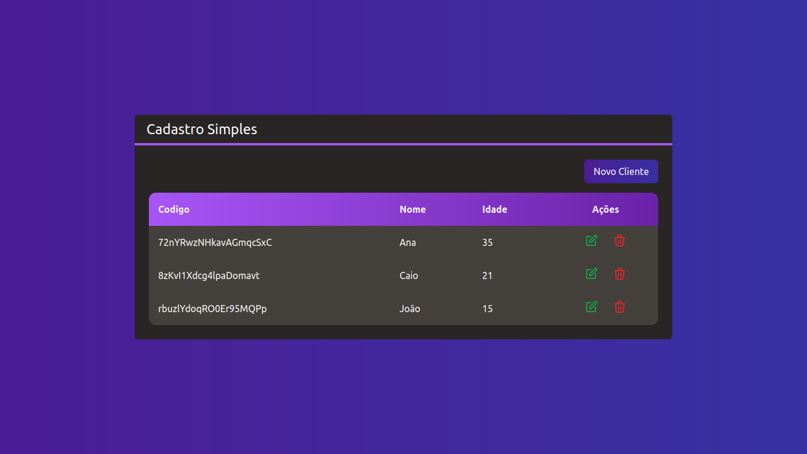

# Estudo da utilização dos principais fundamentos do React

Este projeto segue o curso de react <a href="https://www.udemy.com/course/react-redux-pt/">Curso React + Redux: Fundamentos e 2 Apps do Absoluto ZERO! | Udemy</a>

## Para rodar a aplicação

 - Criar um firestore database no site<a>firebase</a>

Depois de criar um banco de dados, crie um arquivo com o nome .env.local. Apos isso coloques as informações do banco comforme o modelo abaixo

    NEXT_PUBLIC_FIREBASE_API_KEY=[Sua chave]
    NEXT_PUBLIC_FIREBASE_AUTH_DOMAIN=[sua Auth]
    NEXT_PUBLIC_FIREBASE_PROJECT_ID=[seu projeto]

- Para instalar os pacotes
    
        npm install
    
- Para iniciar a aplicação   
    
        npm run dev
